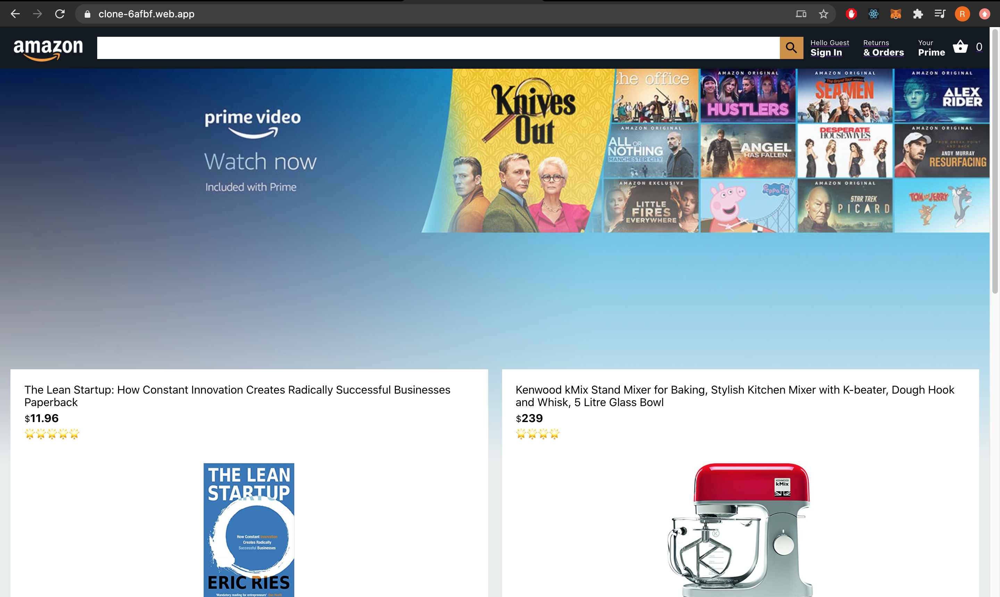
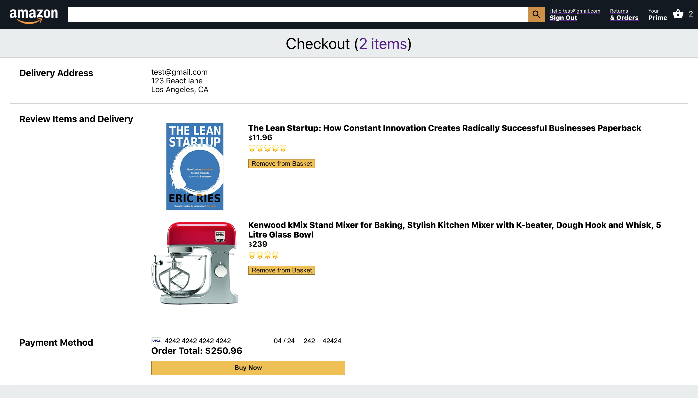
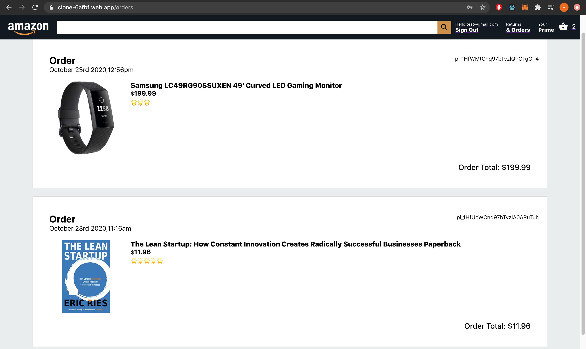

<!-- PROJECT LOGO -->
<br />
<p align="center">
  <a href="">
    
  </a>

  <h3 align="center">Amazon Clone Using ReactJS</h3>

  <p align="center">
    Full stack amazon clone using reactjs integreated with firebase authetication, functions, database, hosting. 
    Fully functional e-commerce with stripe payment gateway.
    <br />
    <a href="https://clone-6afbf.web.app/"><strong>View Live Website »</strong></a>
    <br />
    <br />
   
  </p>
</p>

<!-- ABOUT THE PROJECT -->
## Final Project Screenshots

### Dashboard
<a href="">
    
  </a>
  <br />

### Login Page
<a href="">
    
  </a>
  
### Checkout Page
<a href="">
    
  </a>
  <br />

### Previous Orders(Review Orders page)
<a href="">
    
  </a>
  <br />

## Built With

* [React JS]()
* [React Hooks]()
* [React Context API]()
* [HTML5]()
* [CSS3]()
* [Firebase]()
* [Stripe Gateway]()
* [Node js]()
* [Express JS]()

<!-- GETTING STARTED -->
## Getting Started

To get a local copy up and running follow these simple steps.

### Installation

1. Clone the repo
```sh
git clone https://github.com/shahriya1995/amazon_clone_reactjs.git
```
2. Install NPM packages of front-end
```sh
cd amazon-clone
npm install
```
3. Install NPM packages of back-end
```sh
cd functions
npm install
```

<!-- ROADMAP -->
## Roadmap

### for developers
1. In order to set up your own Firebase Authentication.  
    a. [Login to firebase](https://firebase.google.com/).  
    b. [Setup your own firebase application](https://firebase.google.com/docs/web/setup). 
    c. Copy the configuration in config.js file. 
    
    
2. You can log-in to the project using test-email. 
3. Stripe-Payment Click on the pay with card button and type in the stripe test data(cardnumber: 4242 4242 4242 4242, date: 04/24 and cvc 242 zip:42424). 


<!-- CONTACT -->
## Contact

Riya Shah-  
[LinkedIn](https://www.linkedin.com/in/riyarahulshah/).     
[Portfolio](riya.netlify.app).    
Email - riyashah0595@gmail.com. 
           
Live Website Link: [https://clone-6afbf.web.app/](https://clone-6afbf.web.app/).   
Project Link: [https://github.com/shahriya1995/amazon_clone_reactjs.git](https://github.com/shahriya1995/amazon_clone_reactjs.git).   


